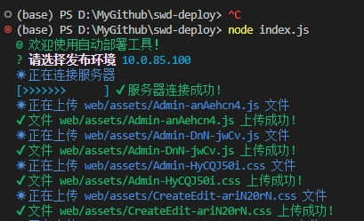

# 前言
我们在常规的前端项目中，前端项目部署都需要经过本地 build 打包、压缩文件、将压缩包上传至服务器并解压文件等步骤，过程较为繁琐。所以本人编写了一个名为 `swd-deploy` 的 `nodejs` 脚本，可通过使用 `npm` 将包安装到你的项目中使用，用来告别手动上传的过程，配置使用简单，实现前端一键自动化部署。

**注意：**
前端自动化编译与部署脚本，当前只支持 `window` 上传至 `linux` 服务器以及 `linux` 上传至 `linux` 服务器。

## 快速安装
```bash
npm i swd-deploy --save
```
## 快速使用 

### 第一步
在你的项目 `package.json` 文件中的 `scripts` 字段中添加如下内容：
```json
{
  "scripts": {
    "deploy": "npx deploy",
  }
}
```
- 说明：
  - 如果你使用 `npm` 安装 `swd-deploy` 包，则需要使用 `npm deploy` 命令来执行部署操作。
  - 如果你使用 `yarn` 安装 `swd-deploy` 包，则需要使用 `yarn deploy` 命令来执行部署操作。
  - 如果你使用 `pnpm` 安装 `swd-deploy` 包，则需要使用 `pnpm deploy` 命令来执行部署操作。
  - 如果你使用 `cnpm` 安装 `swd-deploy` 包，则需要使用 `cnpm deploy` 命令来执行部署操作。

另外，还支持通过命令参数进行自动部署，例如：
```bash
npx deploy --key=production
```
其中 `production` 为 `deploy.config.js` 配置文件中的 `key` 值。


### 第二步
在你项目根目录添加 `deploy.config.js` 文件默认内容如下（可以配置很多...）:
```js
module.exports = Object.freeze({
  development: {//测试
    title: "", //提示标题
    sshIp: 'xx.xxx.xx.xx', // ssh地址 服务器地址
    sshPort: "", // ssh端口 默认：22
    sshUserName: 'xxxxx', // ssh 用户名
    //登录方式 (二选一, 不用的方式注释掉)
    // privateKey: 'C:/Users/Administrator/.ssh/id_rsa', //方式一 使用秘钥登录服务器
    password: 'xxxxxx',  //方式二 用密码连接服务器
    wwwPath: '', // 需要上传的服务器目录地址 如 /usr/local/nginx/html/prodName
    distFolder: 'dist', // 打包后的文件夹 默认 /dist
    loadingStyle: 'arrow4', // 打包后的文件夹 默认 /dist
    buildShell: 'npm run build', // 自定义打包命令 若为空则会直接部署，不会打包
    readyTimeout: 5000 // 超时时间
  },
  production: {//正式
    title: "", //提示标题
    sshIp: 'xx.xxx.xx.xx',
    sshPort: "", // ssh端口 默认：22
    sshUserName: 'xxxxx',
    password: 'xxxxxx',
    wwwPath: '',
    loadingStyle: 'arrow4',
    buildShell: 'npm run build',
    readyTimeout: 5000 
  },
  xxx: {
    ...
  }
  ...
})
```
其中 `development`,`development`，`xxx` 均为 `key` 变量，可自行修改。

**用秘钥登录服务器(推荐)**
* 把本机 公钥` .ssh` 目录下` id_rsa.pub` 放服务器 `authorized_keys` 文件里, 多个电脑公钥换行分开
* `private` 本机私钥文件地址(需要在服务器用户目录 一般是` ~/.ssh/authorized_keys` 配置公钥 并该文件权限为 `600`, (.ssh文件夹一般默认隐藏)
* 一般 `.ssh`在用户目录下  `cd ~/.ssh/ ` 复制路径放下面 `pwd` 可查看当前路径 路径用` / `别 `\` 例如以下 `C:/Users/Administrator/.ssh/id_rsa`

然后执行：
```bash
npx deploy
# 或者
npm run deploy
```
就可以部署了！
## 示例


- GitHub 地址：[https://github.com/zlluGitHub/swd-deploy](https://github.com/zlluGitHub/swd-deploy)
- Gitee 地址：[https://gitee.com/zlluGitHub/swd-deploy](https://gitee.com/zlluGitHub/swd-deploy)
- npm 地址：[https://www.npmjs.com/package/swd-deploy](https://www.npmjs.com/package/swd-deploy)